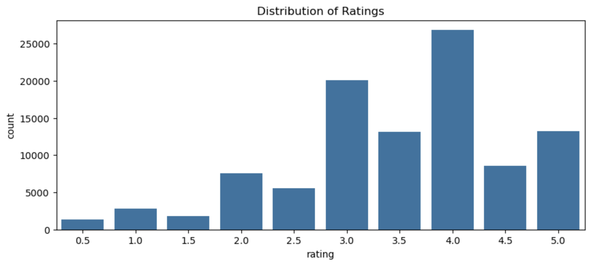
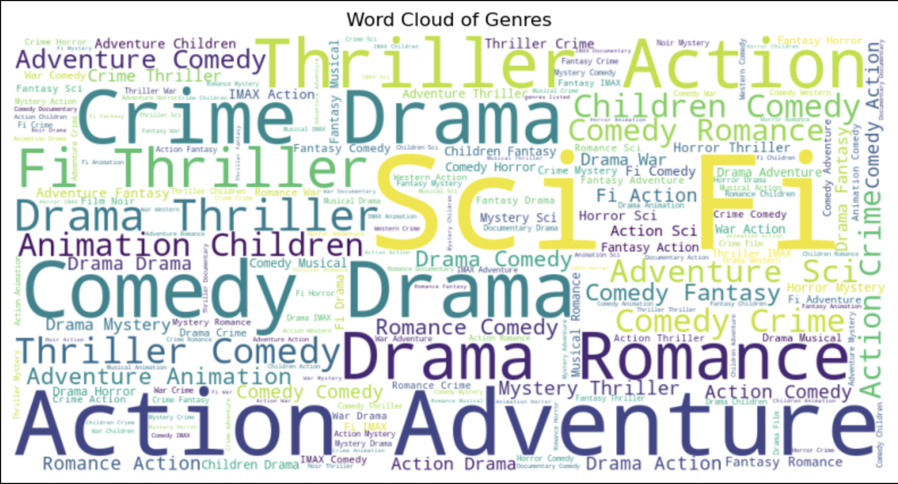
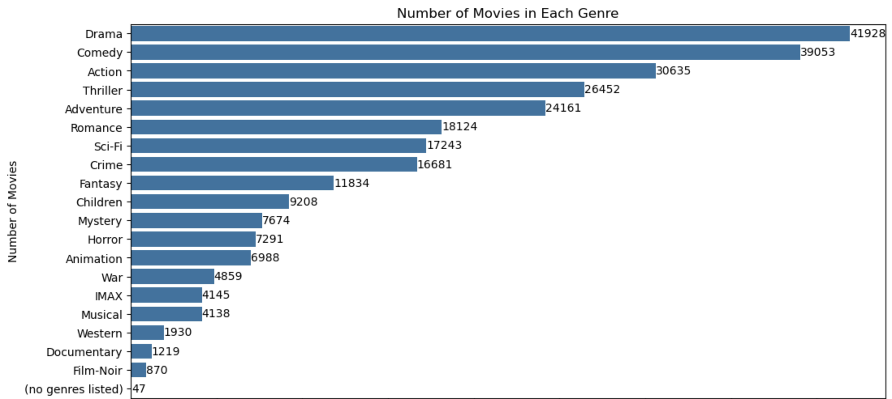

# Hi! This project is to build a model that will predict movie recommendations.


# Index

* [Overview](#Overview)
* [Exploratory Data Analysis](#Visualizations)
* [Collborative Filtering Model Model](#Modeling)
* [Next Steps](#Next-Steps)
* [Repository Structure](#Repository-Structure)

# Important Links

* [Slideshow Presentation](https://github.com/kai-cansler/phase-4-final-movie-rec/blob/main/presentation.pdf)
* [Jupyter Notebook](https://github.com/kai-cansler/phase-4-final-movie-rec/blob/main/notebook.ipynb)

# Overview

We are looking to create a movie recommendation system that provides personalized recommendations to all our users. These recommendations are based on their review ratings, preferences, and viewing history. Collaborative filtering will be used to identify recommendations and improve the accuracy of those suggestions.

Steps:

Data Cleaning
Exploratory Data Analysis
Collaborative filtering
Modeling

# Business Understanding

Movie Lens is trying to improve their platform with movie recommendations. The goal is to improve experience by giving their top 5 personalized recommendations based on viewing history, ratings, and activity. Accuracy is an important metric for our predictions. We will use Root Mean Squared Error (RMSE), which is the average difference between predicted values and actual values.

# Data Understanding

We got the data from ml-latest-small from https://grouplens.org/datasets/movielens/latest/ dataset. The data contains 100,836 ratings, 3,683 tag applications, and 9,742 movies. The data is kept in 4 different data files.

1. Ratings Data File Structure (ratings.csv)
    - Each line of this file after the header row represents one rating of one movie by one user and are on a 5-star scale.
    - Columns: userId,movieId,rating,timestamp
2. Tags Data File Structure (tags.csv)
    - Tags are user-generated metadata about movies. Each tag is typically a single word or short phrase.
    - Columns: userId,movieId,tag,timestamp
3. Movies Data File Structure (movies.csv)
    - Each line of this file after the header row represents one movie and contain title and genre information.
    - Columns: movieId,title,genres
4. Links Data File Structure (links.csv)
    - Identifiers that can be used to link to other sources of movie data
    - Columns: movieId,imdbId,tmdbId

# Visualizations







# Modeling

We explored several models.
1. item-item based model
2. Collaborative filtering models
     - Memory Based: K-Nearest Neighbor (KNN)
     - Model Based: Singular Value Decomposition (SVD)

For the final recommendation model, we used Singular Value Decomposition (SVD). It performed on par with KNN with low RMSE scores (0.8933). The benefits for the SVD model is the scalability with big data and the matrix factorization. We can capture more meta data to be utilized in the SVD model going forward to better improve the performance of our recommendations.

# Conclusion:
In our effort to build a movie reccomendation system, we tested various approaches such as Item-item correlation, Content-Based Filtering using KNN, and a Model-based using SVD. Each approach had its own pros and cons.

Content-Based Filtering: This method suggests movies similar to ones you already like based on their genres. But it might not show you a wide range of options.

Neighborhood-Based Collaborative Filtering (KNN): It finds similar movies by looking at how people interact with them. It's good at spotting patterns but can be slow with lots of data.

Model-Based Collaborative Filtering (SVD): It breaks down your movie preferences into simpler patterns to recommend new movies. It works good even with our smaller dataset. Will be a good choice if we are scaling and increasing our dataset.

# Recommendation:
Its important to consider the trade-offs with each approach. I recommend SVD for scalability and or lightFM with more data. By increasing our data SVD will have more scalability and perform with more accuracy. Light FM will give us the option of exploring user metadata. User-item interactions captured by collaborative filtering will provide diverse and personalized recommendations.

# Next steps
Collect and test on larger dataset, then further hyperparameter tuning and evaluation on our new dataset. We can collect different user meta data to enhance the performance of collaborative filtering techniques. Regular updates to the recommendation engine based on user ratings, metadata and new evolving content can increase its effectiveness over time.

# Repository Structure

```
├── notebook.ipynb
├── data
│   ├── ml-latest-small.csv
├── images
│   ├── dist_ratings.png
│   ├── dist_genre.png
│   ├── word_cloud.png
│   └── stream_movie.png
├── presentation.pdf
└── README.md
```
